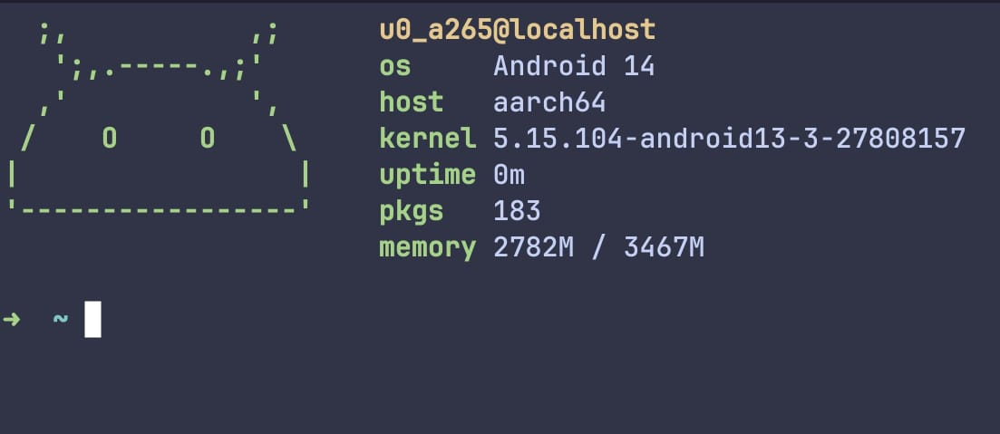

# termux-setup

🚀 Welcome to Termux-Setup, your swift path to a hassle-free Termux configuration! This tool automates the setup process, ensuring a quick and efficient installation of essential packages. 📦 Say goodbye to manual setups and embrace a seamless start to your Termux journey. Get your environment up and running in no time with Termux-Setup! 🔧✨

## Showcase



## Table of Contents

- [Installation](#installation)
- [Themes](#themes)
- [pfetch](#pfetch)
- [Contributing](#contributing)
- [License](#license)

# Installation

1. Install [Termux](https://f-droid.org/en/packages/com.termux/) on your Android device if you haven't already.
2. Open Termux and ensure it's up to date by executing:

```
apt update && yes | apt upgrade
```

3. Again update the packages & Install git :

```
apt update -y  && apt install git -y
```

4. Run the setup script:

```bash
sh -c "$(wget -qO- https://raw.githubusercontent.com/Srinath10X/termux-setup/main/install.sh)"
```

5. Restart the Termux for the changes to take effect.

## Themes

Discover a total of 12 themes, each boasting a unique color scheme and design, within the themes directory. Feel free to explore the options and select a theme that aligns with your preference.

## Pfetch

Included in this repository is the pfetch package. pfetch is a system information tool that presents details about your system in an appealing way. Execute pfetch in your terminal to witness the elegance firsthand.

## Contributing

We invite you to contribute to this repository! Whether you're creating new themes, refining existing ones, or suggesting innovative concepts, here's how you can get involved:

1. Fork this repository.
2. Create a new branch for your contribution:

```
git checkout -b feature/theme-name
```

3. Add your theme file to the themes directory.
4. Update the README to incorporate information about your new theme.
5. Commit your changes and push them to your forked repository.
6. Initiate a pull request to this repository's main branch.

## License

This repository is licensed under the [GPL](LICENSE). You possess the freedom to use, modify, and distribute the themes and pfetch as per your preferences.

---

Experience the fusion of Termux Themes and pfetch, right here in this repository! If you have queries, feedback, or suggestions, feel free to reach out. Embark on a journey of creative terminal customization and system insight!
